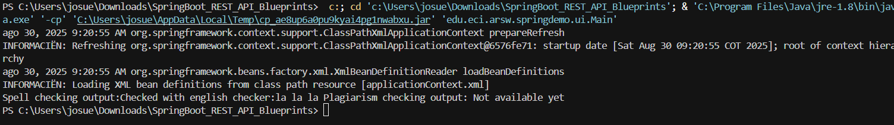
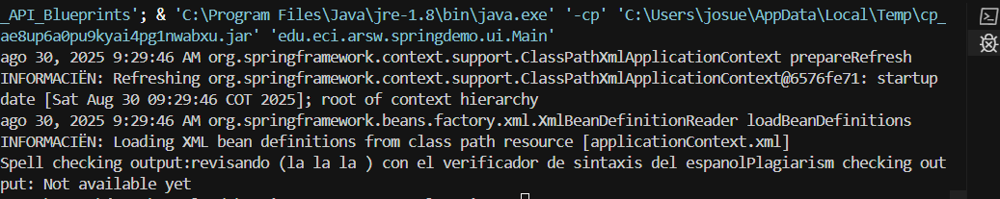

# Escuela Colombiana de Ingeniería
# Arquitecturas de Software - ARSW
### Taller – Principio de Inversión de dependencias, Contenedores Livianos e Inyección de dependencias.
## Josué Hernandez

Parte I. Ejercicio básico.

## Modificaciones Realizadas para Inyección de Dependencias

### Configuración requerida:

**GrammarChecker.java:**
```java
@Service
public class GrammarChecker {
    @Autowired
    SpellChecker sc;
    // ... resto del código
}
```

### Caso 1: Usando EnglishSpellChecker

**EnglishSpellChecker.java:**
```java
@Service  
public class EnglishSpellChecker implements SpellChecker {
    // ...
}
```

**SpanishSpellChecker.java:**
```java
// Sin @Service
public class SpanishSpellChecker implements SpellChecker {
    // ...
}
```

**Resultado:**
```
Spell checking output:Checked with english checker:la la la Plagiarism checking output: Not available yet
```



### Caso 2: Usando SpanishSpellChecker

**EnglishSpellChecker.java:**
```java
// Sin @Service ← NO es candidato
public class EnglishSpellChecker implements SpellChecker {
    // ...
}
```

**SpanishSpellChecker.java:**
```java
@Service  
public class SpanishSpellChecker implements SpellChecker {
    // ...
}
```

**Resultado:**
```
Spell checking output:revisando (la la la ) con el verificador de sintaxis del espanolPlagiarism checking output: Not available yet
```



### ¿Por qué cambian los resultados?

El resultado cambia porque cada implementación tiene diferente lógica en `checkSpell()`:

- **EnglishSpellChecker:** `"Checked with english checker:" + text`
- **SpanishSpellChecker:** `"revisando (" + text + ") con el verificador de sintaxis del espanol"`

Spring inyecta automáticamente la única clase marcada con `@Service`, cambiando el comportamiento sin modificar `GrammarChecker`.